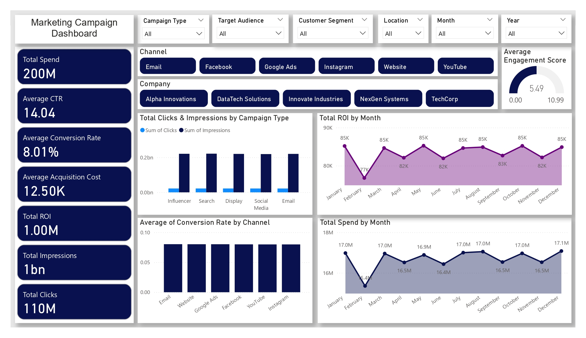
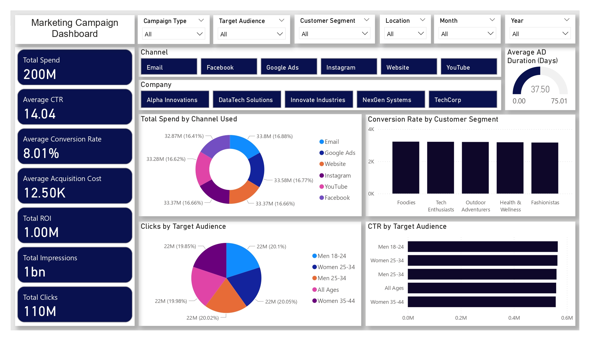

# Marketing Campaign Analysis Dashboard

## Project Overview
This project analyzes **marketing campaign performance** to uncover insights into campaign effectiveness, audience engagement, and return on investment (ROI).  

Using **Power BI**, **Python (Pandas, Jupyter Notebook)**, and cleaned marketing data, the project delivers an **interactive dashboard** that empowers stakeholders to track key performance metrics, identify trends, and make data-driven marketing decisions.  

---

## Business Problem
Organizations spend heavily on digital marketing across multiple channels but often lack clarity on **which campaigns deliver the best results**.  

This project addresses:
- Which **channels** drive the highest conversions and ROI?  
- Which **target audiences** show the strongest engagement?  
- How do **spend, clicks, and ROI** vary month-to-month?  
- Where can we **reduce acquisition costs** without hurting performance?  

---

## Tools & Technologies
- **Python** – Data cleaning & KPI preparation (Jupyter Notebook)  
- **Pandas / NumPy** – Data manipulation  
- **Power BI** – Dashboard development & visualization  
- **Excel** – Preliminary analysis  

---

### Dataset Information

- **Source:** [Kaggle – Marketing Campaign Dataset](https://www.kaggle.com/datasets/guelmaniloubna/marketing-campaign-dataset)  
- **Description:** Contains data on marketing campaigns, including customer interactions, campaign types, costs, and outcomes. Used to analyze campaign performance and calculate KPIs like CTR, conversion rate, and cost per acquisition.  
- **Size:** ~200006 rows × 15 columns

---

## Files in This Repository
- **`Marketing_Campaign_Dashboard.pbix`** → Interactive Power BI dashboard file.  
- **`Marketing_Campaign_Dashboard.pdf`** → Exported PDF version of the dashboard for quick review.  
- **`Marketing_Campaign_Dashboard_page1.jpg` & `Marketing_Campaign_Dashboard_page2.jpg`** → Dashboard screenshots (Overview & Performance Trends).  
- **`Marketing_Campaign_Cleaned.csv`** → Cleaned dataset used for analysis and dashboard building.  
- **`marketing_campaign.csv`** → Raw dataset (original file before cleaning).  
- **`Marketing_Campaign_Data_Cleaning.ipynb`** → Jupyter Notebook for data cleaning, KPI calculations, and preprocessing.  
- **`Insights_and_Recommendations.pdf`** → Final report summarizing business insights and recommendations.

---

## Dashboard Preview

  

---

## Key Insights
- **Email, Google Ads, and Website campaigns** deliver the best conversion performance.  
- **Instagram & YouTube** show **lower ROI** despite similar budget allocation.  
- The **25–34 age group (especially women)** is the most engaged segment.  
- **ROI dips in February**, suggesting seasonal inefficiency.  
- **Average Acquisition Cost = 12.5K**, highlighting opportunities for optimization.  

---

## Recommendations
1. **Reallocate budget** toward high-performing channels (Email, Google Ads, Website).  
2. Double down on **25–34 year old audiences** with personalized campaigns.  
3. Investigate **February ROI drop** and adjust seasonal marketing strategies.  
4. Improve **customer acquisition efficiency** with retargeting and optimized landing pages.  
5. Boost engagement by introducing **interactive and personalized content**.  

---

## Deliverables
- **Data:** Raw & cleaned datasets (`.csv`)  
- **Notebook:** Data cleaning & KPI preparation (`.ipynb`)  
- **Dashboard:** Interactive Power BI file (`.pbix`), PDF & images  
- **Report:** Insights & recommendations (`.pdf`)  

---

## Conclusion
This project demonstrates how **data analytics and visualization** can help optimize marketing campaign strategies, improve ROI, and guide **data-driven business decisions**.  

The dashboard can be extended with:
- Predictive modeling (forecasting campaign ROI)  
- Customer segmentation with clustering  
- Real-time data integration  

---

## Connect with Me  
I’m always open to networking, collaboration, or discussing exciting data opportunities.  

---

## License  
This project is licensed under the **MIT License**.